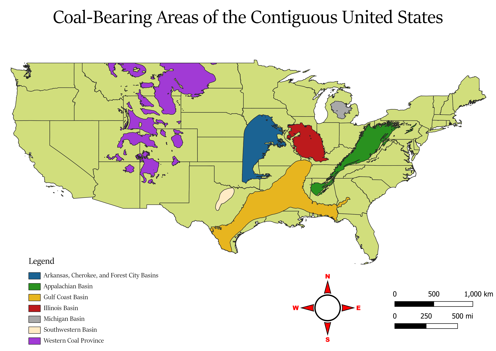
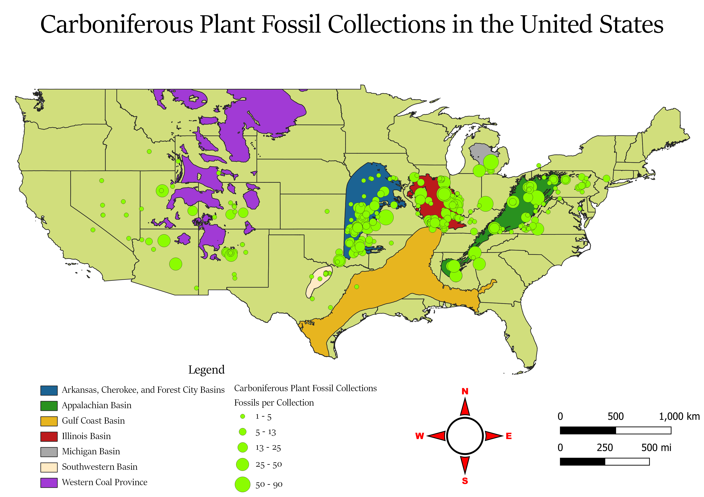
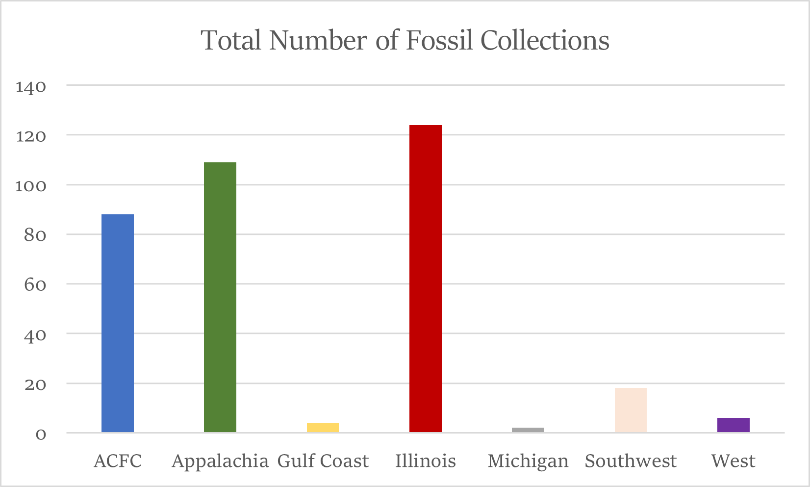
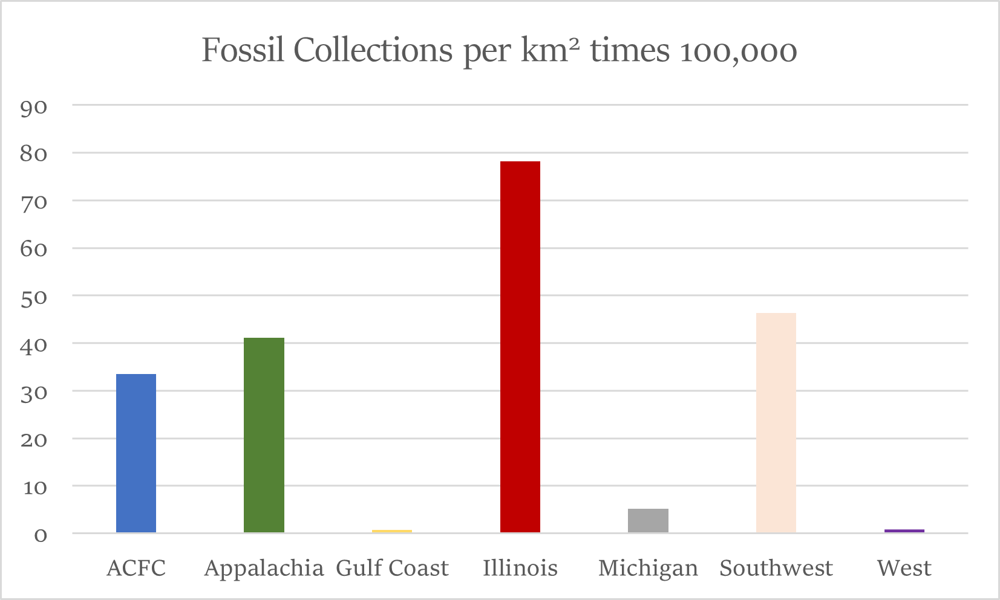
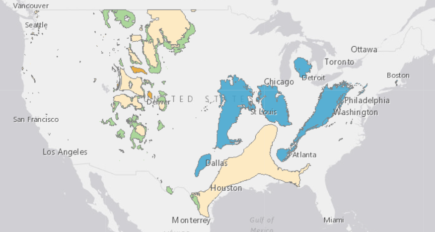
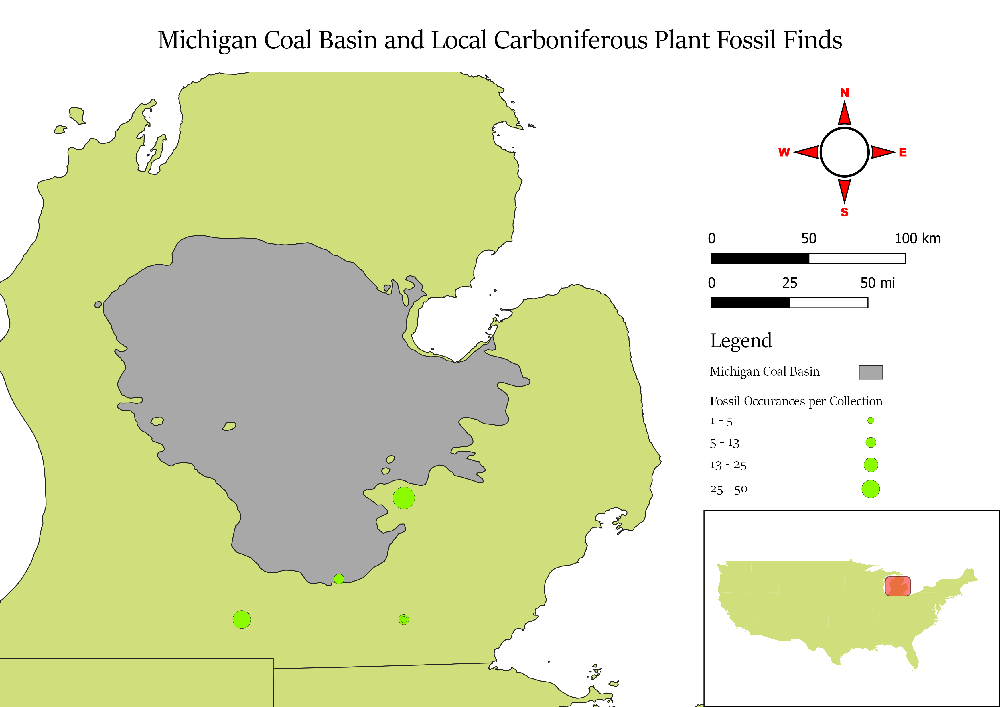
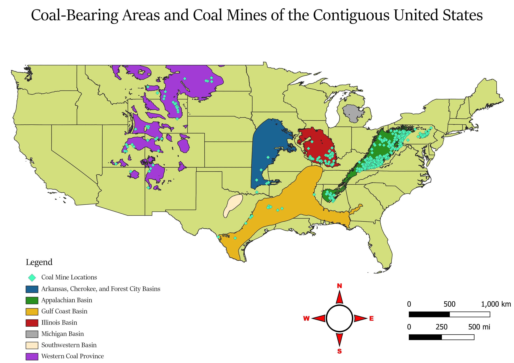
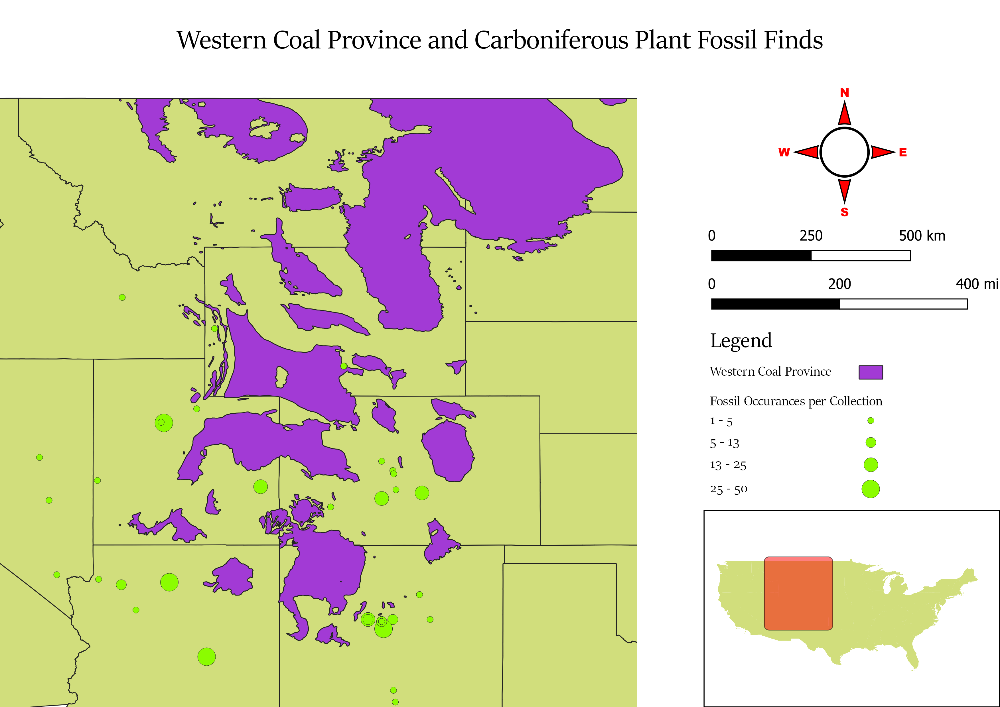

<html>
    <header style = "color: #0366d7">
        
Mapping Coal Beds and Carboniferous Plant Fossils in the US

    </header>
    <body style = "color: #0366d7">
        
The goal of this project is to analyze the spatial relationship between the fossilzed remains of plants from the Carboniferous Period and the coal beds that they are attributed to forming
  
          
        
The map below includes all locations of carboniferous plant fossil collections. The size of each dot corresponds to the number of fossil occurances in that collection. By overlaying the fossil data, we can see a strong correlation between the locations of coal beds and carboniferous plant fossil finds with the exception of the Gulf Coast Basin and the Western Coal Provinces.
  
          
        
To quantify this result, all fossil collections located on a coal bed or within 10 kilometers of one were tallied for each coal-bearing region. In addition, the number of fossil collection per kilometer squared was also calcualated in order to account for the areas. (The result of this calcuation was scaled up by 100,000 in order to display it on the bar graph.)
  
         
           
        
From these graphs it can be deduced that the Arkansas, Cherokee, and Forest City Basins, the Appalachian Basin, the Illinois Basin, the Michigan Basin, and the Southwestern Basin must have been formed during the Carboniferous and that the Western Coal Provinces and the Gulf Coast Basin formed during other periods in Earth's history. This is in line with the geological and paleontological consensus surrounding the formation of these coal beds. The map below from the USGS indicates the age of the coal beds in the US with blue symbolizing the late Carboniferous and green, orange, and yellow symbolizing coal beds formed in the Cretaceous and Tertiary Periods. 
   
           
        
There remains, however, and interesting outlier. The Michigan Basin, while being formed during the Carboniferous, has far fewer plant fossils per square kilometer compared to the other carboniferous coal beds. 
   
           
        
A potential explanation for this may be the lack of coal mines in Michigan. According to the plant fossil dataset, many carboniferous plant fossils are found in coal mines. If there are no such mines in Michigan, this may impede the efforts of paleontologists to discover new specimens. 
  
           
        
Another question raised by the result of this project is why are there many carboniferous plant fossils in the Western US that are not a part of any coal basin. In the eastern US, by contrast, almost all plant fossils are concentrated in or around a coal bed. The geological reason for this could worth looking into in the future. 
           
    </body>
</html>
