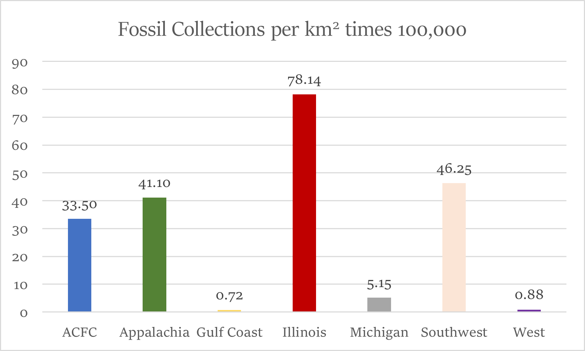

<html>
    <header style = "color: #0366d7">
        
Mapping Coal Beds and Carboniferous Plant Fossils in the US

    </header>
    <body style = "color: #0366d7">
        
The goal of this project is to analyze the spatial relationship between the fossilzed remains of plants from the Carboniferous Period and the coal beds that they are attributed to forming

        
        
The map below includes all locations of carboniferous plant fossil collections. The size of each dot corresponds to the number of fossil occurances in that collection. By overlaying the fossil data, we can see a strong correlation between the locations of coal beds and carboniferous plant fossil finds with the exception of the Gulf Coast Basin and the Western Coal Provinces.  

        
        
To quantify this result, all fossil collections located on a coal bed or within 10 kilometers of one were tallied for each coal-bearing region. In addition, the number of fossil collection per kilometer squared was also calcualated in order to account for the areas. (The result of this calcuation was scaled up by 100,000 in order to display it on the bar graph.)
          
    </body>
</html>
